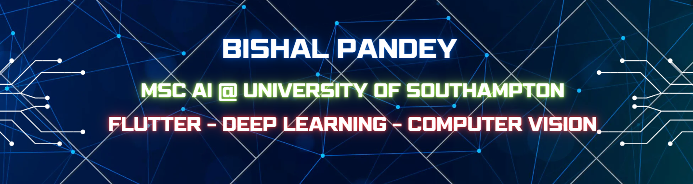

<!-- 🎯 Banner -->

  

<h1 align="center">Hi 👋, I'm Bishal Pandey</h1>
<h3 align="center">AI • Machine Learning • Flutter • Computer Vision</h3>

  

---

### 🧑‍💻 About Me

🎓 MSc Artificial Intelligence @ **University of Southampton**  
🏅 Gold Medalist in B.Tech (IT) from **NEHU**  
📱 Crafting **AI-powered Flutter apps**  
🧠 Exploring **Deep Learning, TFLite, CV, and Transformers**   
💡 Passionate about building tech that creates real-world impact  

---

### 🛠️ Tech Stack

**Languages & Core:**  

**Mobile & UI:**  

**AI/ML & Tools:**  

---

### 🚀 Projects Worth Exploring

🔍 **AI/ML Math Book**  
*A free, open-source LaTeX handbook covering the mathematical foundations of AI, ML, CV & DL.*

🌿 **Plant Disease Classifier**  
*ML-powered solution using CNN + TFLite for detecting plant leaf diseases.*

🚌 **Bus Tracking App**  
*A real-time location-tracking app built with Flutter + Google Maps SDK.*

📲 **Quizzer App**  
*Dynamic quiz platform using Flutter and Firebase for real-time scores.*

📷 **FINSTAGRAM**  
*A Flutter prototype of a photo-sharing social media app.*

🧮 **MNIST Digit Classifier**  
*Simple neural net on the classic MNIST dataset — coded from scratch.*

---

### 📈 GitHub Stats

  
   
  

---

### 📫 Connect With Me

  
  
  

---

<i>"Striving to build smarter apps and a better future — one model at a time."</i>

